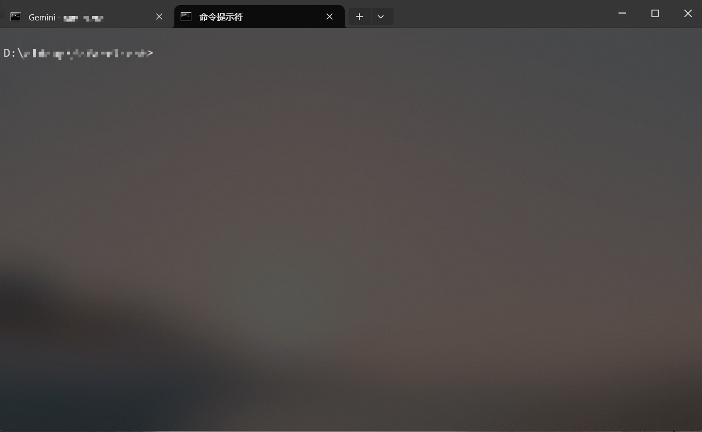

# F-Proxy

这是一个由 AI 辅助生成的项目，旨在帮助用户在 Fofa 上搜索并验证免费的代理订阅链接。

## 项目初衷

本项目源于一个简单的想法：不想购买昂贵的代理服务。因此，我让AI生成了这个工具，能够利用 Fofa 的强大搜索能力，自动发现并验证互联网上公开的免费代理订阅链接。

## 功能特点

-   **Fofa 搜索**：根据预设的 Fofa 语法搜索潜在的代理订阅提供者。
-   **智能协议识别**：根据 Fofa 返回的协议信息（HTTP/HTTPS）构建准确的访问链接。
-   **并发访问**：高效地并发访问多个目标网站，获取页面内容。
-   **订阅链接提取**：从网页内容中智能提取符合特定格式的代理订阅链接。
-   **链接去重**：在验证前自动去除重复的链接，提高效率。
-   **有效性验证**：对提取到的订阅链接进行验证，检查是否返回 Base64 编码内容且不包含“token”错误。
-   **实时进度显示**：通过美观的彩色进度条，实时显示任务进度。
    -   **可配置参数**：并发数和 Fofa 查询数量可通过 `.env` 文件配置。

### Demo



## 使用方法

1.  **克隆项目**：
    ```bash
    git clone https://github.com/clddup/F-Proxy.git
    cd F-Proxy
    ```

2.  **安装依赖**：
    本项目使用 Bun 作为运行时和包管理器。请确保您已安装 Bun。
    ```bash
    bun install
    ```

3.  **配置 Fofa API Key**：
    在项目根目录下创建一个名为 `.env` 的文件，并填入您的 Fofa API Key、并发限制和 Fofa 查询结果数量。
    ```env
    FOFA_KEY="您的Fofa API KEY"
    CONCURRENCY_LIMIT=5  # 并发请求数，默认为5
    FOFA_SIZE=20         # Fofa查询结果数量，默认为20
    ```
    您可以从 [Fofa 个人资料页面](https://fofa.info/userInfo) 获取您的 API Key。

4.  **运行脚本**：
    ```bash
    bun run index.ts
    ```

    脚本将自动执行 Fofa 查询、访问目标网站、提取并验证订阅链接，最终在控制台输出所有有效的订阅链接。

## 注意事项

-   请遵守 Fofa 的使用政策和相关法律法规。
-   免费代理的稳定性和安全性无法保证，请谨慎使用。
-   本项目仅用于学习和研究目的，请勿用于非法用途。

## 免责声明

本项目仅供学习、研究和个人非商业用途。开发者不对因使用本项目而导致的任何直接或间接损失承担责任。用户在使用本项目时，应自行承担所有风险，并确保遵守所有适用的法律法规。本项目不鼓励、不纵容任何非法活动。